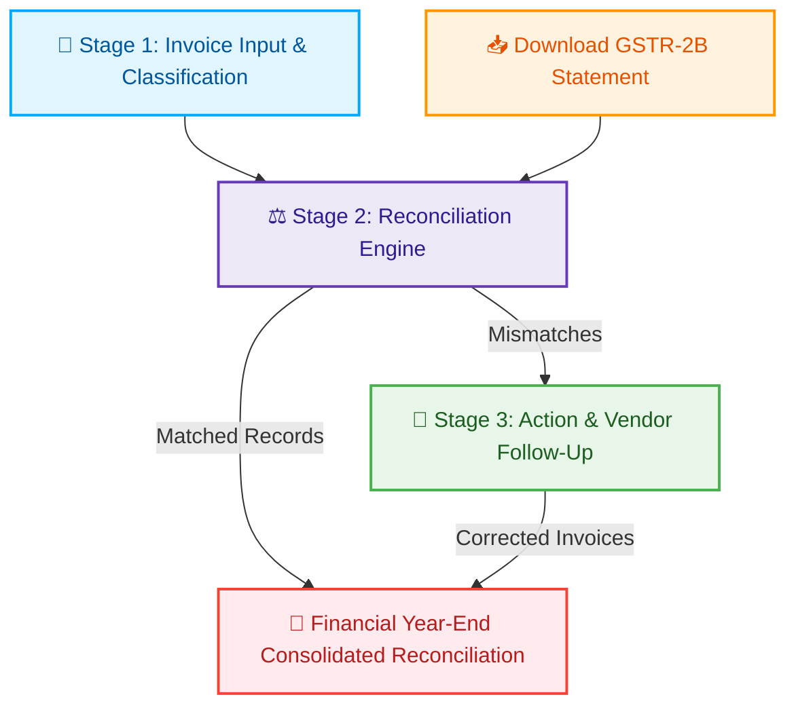

# 📊 GST Compliance & Reconciliation Workflow

This document outlines the end-to-end GST processing workflow designed for your Chartered Accountant (CA) and tax operations. It covers invoice entry, monthly GSTR-2B matching, actionable discrepancy handling, and financial year-end reconciliation.

---

## 🗺️ Process Flow

---

## 📂 Stage 1: Bill Input & GST Segregation
This is the **data capture and classification** phase. All purchase invoices must be recorded in your internal books of accounts (Purchase Register).

### Key Operations
1. **Invoice Details Capture**: Extract Invoice Number, Invoice Date, Supplier GSTIN, Taxable Value, Tax Rates, and Tax Amounts.
2. **GST Segregation**:
   * **IGST** (Integrated GST) for interstate purchases.
   * **CGST + SGST** (Central + State GST) for intrastate purchases.
   * **Tax Rate Slabs**: Split by slabs (5%, 12%, 18%, 28%).

> [!TIP]
> **ITC Eligibility Split**
> Segment your input tax credit into:
> * **Eligible ITC**: Purchases directly matching business advancement.
> * **Ineligible ITC (Blocked under Sec 17(5))**: Items like motor vehicles, food & beverages, catering, and employee welfare.
> * **Flat 50% Rule**: In some industries (like banking/financial sectors), a flat 50% eligible / 50% ineligible split is applied.

---

## 🔍 Stage 2: GSTR-2B Comparison & Mismatch Reporting
This stage matches your **internal books** against the **government GST portal data** to verify tax credits.

* **GSTR-2B**: A static, auto-drafted ITC statement generated by the GST portal on the 14th of every month listing what your vendors have declared in their GSTR-1 returns.

### The Reconciliation Matrix

| Field | Matching Criteria | Handling Rounding & Discrepancies |
| :--- | :--- | :--- |
| **Supplier GSTIN** | 🔑 **Exact Match** | Must match 100% to ensure tax credit is directed to your business. |
| **Invoice Number** | 🔍 **Fuzzy Match** | Ignore symbols (e.g. `/`, `-`), spaces, and leading zeros (e.g. `0056` vs `56`). |
| **Invoice Date** | 📅 **Date Range** | Match within a $\pm 30$ days window to handle month-of-entry variations. |
| **Amounts** | 🪙 **Threshold Range** | Accept minor differences within $\pm$ ₹10 for rounding differences. |

### Reconciliation Status Categories

> [!NOTE]
> **1. Fully Matched**
> The invoice exists in both internal books and GSTR-2B with matching tax values.
> * **Action:** ITC is cleared to be claimed.

> [!WARNING]
> **2. Mismatched (Value Difference)**
> The invoice matches by number, but tax/taxable values differ (e.g. supplier declared ₹1,800 instead of ₹18,000).
> * **Action:** Put credit on hold; report difference to vendor.

> [!CAUTION]
> **3. Missing in GSTR-2B**
> The invoice is in your books, but not in GSTR-2B.
> * **Action:** **Do not claim ITC yet.** The supplier hasn't uploaded it. Put credit in the "Pending Ledger" and notify the supplier.

> [!NOTE]
> **4. Missing in Books**
> The invoice is in GSTR-2B, but not in your books.
> * **Action:** Verify if it is an unrecorded purchase or if a supplier accidentally used your GSTIN.

---

## 📣 Stage 3: Vendor Action & ITC Action Center (The Missing Stage)
Knowing the mismatch is not enough. You must act on it to prevent tax loss. Stage 3 completes the cycle by turning matching results into **compliance actions**.

### Key Features of Stage 3:
1. **Automated Vendor Follow-up**:
   * Generate communication drafts (emails/reports) listing the specific missing/incorrect invoices.
   * Send notifications to suppliers demanding they upload/correct invoices in their next return.
2. **ITC Claim Approval Ledger**:
   * A dynamic ledger classifying credits as **"Claimable"** (Matched) vs **"Pending"** (Missing in GSTR-2B).
   * Feeds directly into your monthly **GSTR-3B** return filing calculations.

---

## ⏳ Year-End Reconciliation & Storing Bills FY-Wise

For audit compliance and tax planning, storing invoices by **Financial Year (April 1 to March 31)** is mandatory.

> [!IMPORTANT]
> **Why Year-End Reconciliation is Crucial**
> * **Hard Deadlines:** Under Indian GST laws, the last date to claim or correct any ITC for a financial year is **November 30** of the following financial year. Any unclaimed tax credits after this deadline are **lost permanently**.
> * **Annual Return (GSTR-9):** Table 8 of the annual return demands a consolidated reconciliation of your Books vs. the cumulative portal GSTR-2A/2B details.
> * **Audit Readiness (GSTR-9C):** Companies with turnovers over ₹5 crore must submit a self-certified GSTR-9C reconciliation statement, reconciling filed GST returns with audited financial balance sheets.

---

## 🛠️ App Design Suggestions (For Next Steps)

1. **FY-Based Partitioning**:
   * Automatically calculate `financial_year` (e.g., `2025-2026`) based on the invoice date.
   * Allow users to filter/view invoices and reconciliation summaries grouped by Financial Year.
2. **Exportable Discrepancy Reports**:
   * Generate colorful Excel sheets highlight-coding Matched (Green), Mismatched (Yellow), and Missing (Red) rows for quick CA review.
